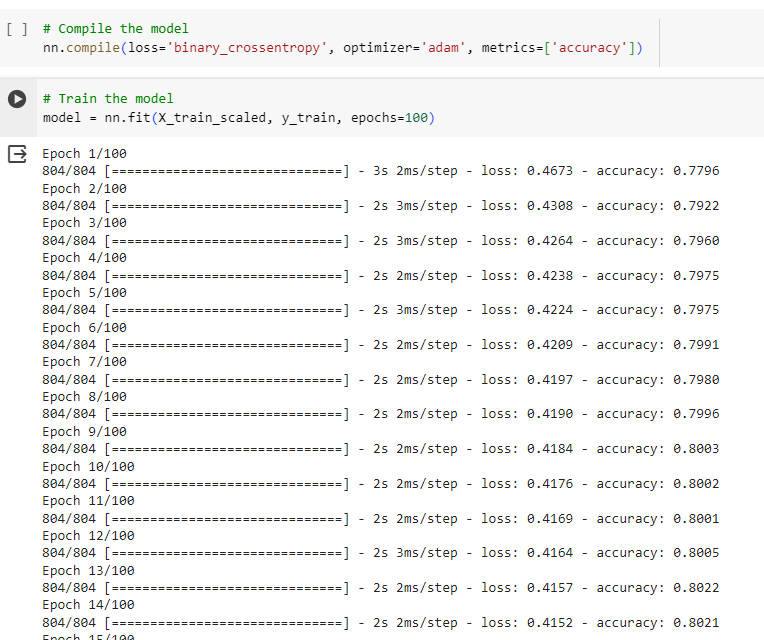

# Deep Learning

## Description
Formulate a tool to help find best chances for success for funding ventures.
Write an analysis that includes a title and multiple sections, labeled with headers and subheaders (4 points)
Format images in the report so that they display correction (2)
Explain the purpose of the analysis (4)
Answer all 6 questions in the results section (10)
Summarize the overall results of your model (4)
Describe how you could use a different model to solve the same problem, and explain why you would use that model (6)

## Table of Contents
- [Installation](#installation)
- [Usage](#usage)
- [Credits](#credits)
- [License](#license)
- [Features](#features)
- [Tests](#tests)
- [Contact](#contact)
- [Data Processing](#data_processing)
- [Compiling](#compiling)

## Installation
Python, Juptyr notebook, colab 

## Usage
Whether applicants will be successful if funded by Alphabet Soup.

## Credits
Emilia 

## License
MIT

## Features
Provides train model for optimizing predictions

## Tests
once the application runs confirms the optimized h5 file is created

## Contact
If there are any questions of concerns, I can be reached at:
##### [github: emilife](https://github.com/emilife)
##### [email: emilifedesigns@gmail.com](mailto:emilifedesigns@gmail.com)

## Data Preprocessing

### What variable(s) are the target(s) for your model?
IS_SUCCESSFUL is the target feature.

### What variable(s) are the features for your model?
varialbe X

### What variable(s) should be removed from the input data because they are neither targets nor features?
EIN

## Compiling, Training, and Evaluating the Model

### How many neurons, layers, and activation functions did you select for your neural network model, and why?
121 neurons, 3 layers and ativation functions Relu and Sigmoid

### Were you able to achieve the target model performance?
Yes

### What steps did you take in your attempts to increase model performance?
Added the Name feature and binned it.